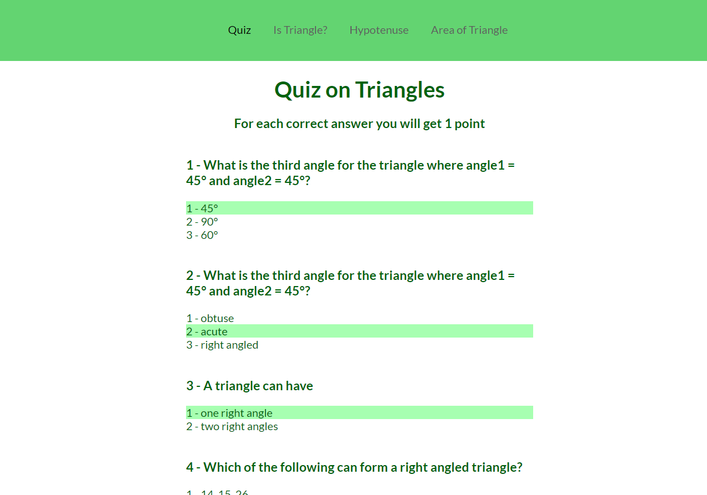

## Mark 12 - Fun with Triangles 
   
It is developed using Reactjs, [live demo ](https://fun-triangles.vercel.app/) hosted on vercel.
Does some mathematics operation related to Traingles and Quiz on triangles.'

#### Features 
- Quiz on triangles- Make a Quiz on triangles and calculate the score of the user.
- Calculates the length of the hypotenuse- Have two input fields for base value & height value, calculate the hypotenuse of the triangle, and show the output to the user.
- Calculates the area of the triangle- Make a calculator which calculates the area of a triangle using the user's input and shows the output to the user.
- Check whethers angles form a triangle - Have three input fields to take three angles from the user and calculate whether the angles entered by the user form a triangle or not and show the respective output to the user.

#### Screenshot

### `yarn start` or `npm start`

Runs the app in the development mode.\
Open [http://localhost:3000](http://localhost:3000) to view it in the browser.

## Learn More

You can learn more in the [Create React App documentation](https://facebook.github.io/create-react-app/docs/getting-started).

To learn React, check out the [React documentation](https://reactjs.org/).
